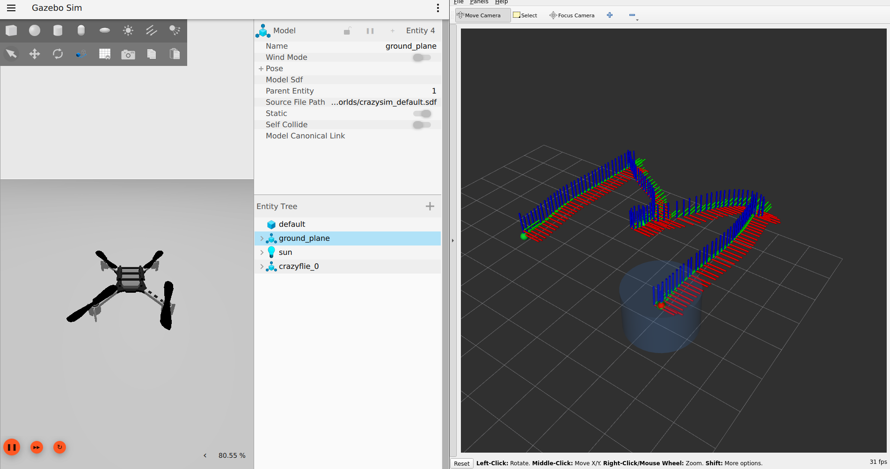
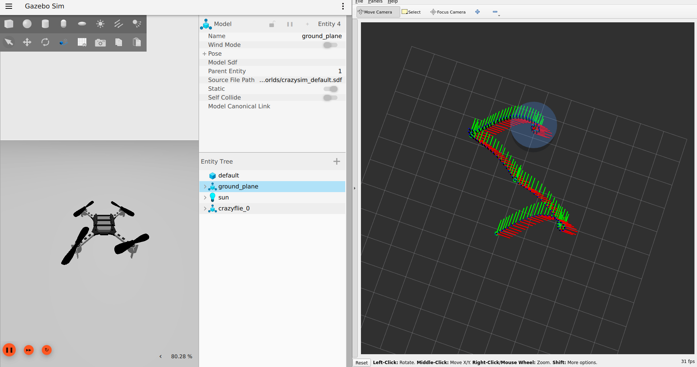

# CrazySim ET-Tube MPC

Event-Triggered Tube MPC for a Crazyflie nano quadrotor in CrazySim Software-in-the-Loop.
Drone follows **M** or **S** waypoint paths in Gazebo with the mRPI safety tube visualised live in RViz2.

## From Docker Image

The whole working stack (Gazebo + ROS 2 Humble + cf2 SITL + cflib + MPC) is published on Docker Hub:

**<https://hub.docker.com/r/rebelpg/crazysim_et_mpc/tags>**

```bash
# Pull the image (~2.6 GB)
docker pull rebelpg/crazysim_et_mpc:latest

# Allow Docker root to use your X server (Linux)
xhost +local:docker

# Run with X11 + GPU-fallback rendering
docker run -it --rm \
  --env DISPLAY=$DISPLAY --env LIBGL_ALWAYS_SOFTWARE=1 \
  --volume /tmp/.X11-unix:/tmp/.X11-unix:rw \
  --network host \
  rebelpg/crazysim_et_mpc:latest \
  bash
```

Inside the container you get a banner with three commands:

```
phase1        # hover test (verify SITL is working)
phase2 M      # ET-Tube MPC follows M trajectory  (default)
phase2 S      # ET-Tube MPC follows S trajectory
stop_sitl     # kill all
```

## ▶ Demo

`phase2 M` — drone spawns at `(0,0)`, takes off to z=1.0 m, then traces the M shape. Gazebo on the left, RViz on the right with the mRPI tube and waypoint trail.



`phase2 S` — same drone, same arena, S-shaped trajectory `[0,0] → [1,0.5] → [0,1] → [-1,1.5] → [0,2]` at z=1.0 m. RViz shows the trail looping through the S-curve and the cylinder following the MPC's nominal pose.



What you're seeing in RViz:

- **Cyan axes** (cf_1 odom, 45 Hz) — the actual drone pose
- **Yellow dot** (`/drone/nominal_pose`) — where MPC's plan says the drone *should* be one step ahead
- **Translucent blue cylinder** — the mRPI tube Ω, radius 0.408 m, projected from the 72-facet polytope in `tube_data.npz`
- **Green spheres** — waypoints accumulated as `/waypoint` is published
- **Red spheres** — ET trigger events (the QP fired); they fade out after 2 s
- **Trail** (`Keep=500`) — recent odom history, draws the actual flight path

Full architecture, bug log, and tuning knobs are in **[`PROJECT_REPORT.md`](PROJECT_REPORT.md)** and **[`mpc_ws/docs/PHASE2_COMPLETE.md`](mpc_ws/docs/PHASE2_COMPLETE.md)**.

## What's in this repo

```
.
├── README.md                              ← this file
├── PROJECT_REPORT.md                      ← long-form project doc (all bugs, fixes, architecture)
├── LICENSE                                ← MIT
├── .gitignore                             ← repo-wide ignores
├── .gitmodules                            ← upstream pins
├── requirements.txt                       ← pip deps if you want a native (non-docker) install
├── setup.sh                               ← native install helper (clones + builds; advanced)
├── configs/
│   └── crazyflies.yaml                    ← our patched config (UDP loopback + odom logging)
├── docs/
│   ├── PHASE1_COMPLETE.md                 ← Phase 1 wrap-up (hover test)
│   └── PHASE2_COMPLETE.md                 ← Phase 2 wrap-up (MPC + tube viz)
├── screenshots/
│   ├── m_trajectory_simulation.png
│   └── s_trajectory_simulation.png
├── mpc_ws/                                ← OUR work — the ROS 2 workspace
│   ├── phase1/                            ← Phase 1 launcher + CFLib hover test
│   ├── phase2/                            ← Phase 2 trajectories, RViz config, README
│   └── src/lcs_tube/                      ← lcs ROS 2 package (cflib_bridge_node, et_tube_mpc_node, ...)
├── CrazySim/                              ← submodule → gtfactslab/CrazySim @ 85dd1ee
└── crazyflie-clients-python/              ← submodule → bitcraze/crazyflie-clients-python @ 16a5148
```

## Native install (advanced — Docker is easier)

If you really don't want Docker:

```bash
# Clone with submodules
git clone --recursive <this-repo-url>
cd <this-repo>

# Run the helper
./setup.sh
```

`setup.sh` will install apt deps, pip deps (incl. the CrazySim cflib fork), apply the patched `crazyflies.yaml`, and build firmware + workspaces. Tested only on Ubuntu 22.04 with ROS 2 Humble + Gazebo Garden.

If you skip `setup.sh` and want to do it manually, see **[`PROJECT_REPORT.md` → "Native install"](PROJECT_REPORT.md)**.

## Tested versions

- Ubuntu 22.04 LTS
- ROS 2 Humble
- Gazebo Sim Garden 7.9.0
- Python 3.10
- CrazySim @ `85dd1ee4` (gtfactslab/CrazySim)
- Crazyflie firmware @ `3450c0ef` (llanesc/crazyflie-firmware fork)
- cflib (CrazySim fork) @ `84f9d520`
- crazyflie-clients-python @ `16a5148c`
