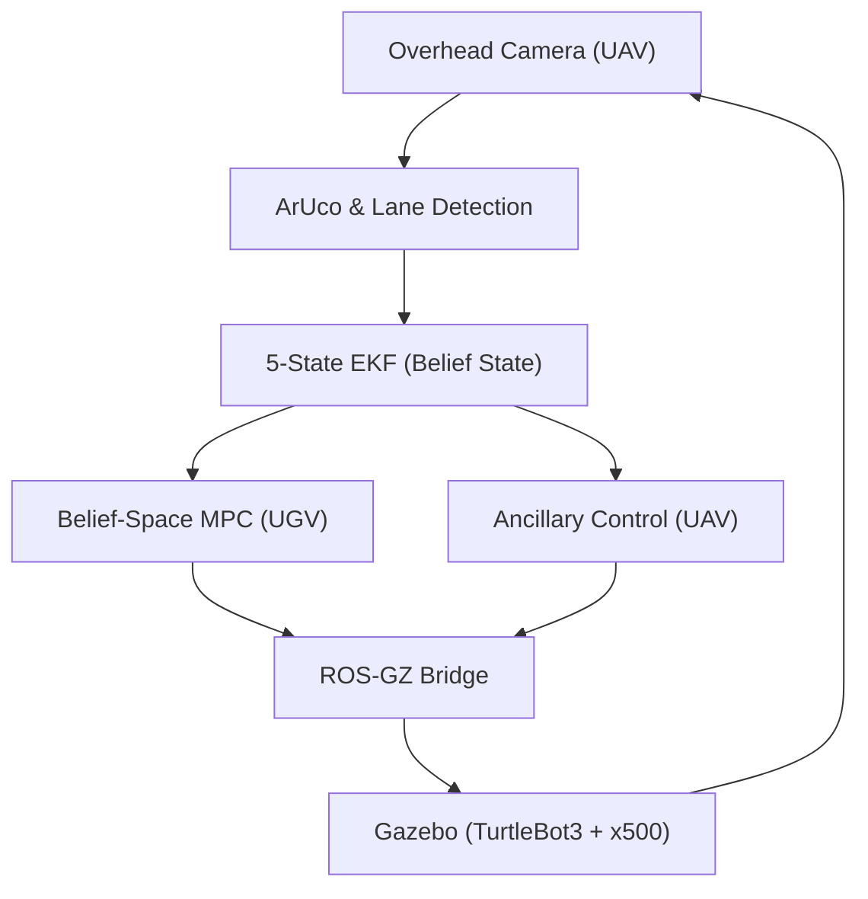

# 03: System Integration and Validation (ROS 2)

This folder contains the complete ROS 2 and Gazebo integration for the UAV-UGV tracking mission. This phase serves as the high-fidelity validation of the mathematical models from Phase 1 and the flight trajectories from Phase 2.

## System Architecture


## Key Implementation Details
*   **Perception**: OpenCV-based lane centerline extraction and ArUco ID 55 tracking.
*   **Estimation**: 5-state Extended Kalman Filter (EKF) with dynamic measurement noise ($R_k$).
*   **Control**: 
    *   **Belief-Space MPC**: UGV path following with observability constraints.
    *   **Ancillary Tube-MPC**: UAV altitude and pose adaptation for FoV maintenance.

## Codebase Overview
The core logic is implemented in the following nodes within `src/ugv_uav_control/ugv_uav_control/`:
*   **`belief_mpc_node.py`**: Implements the UGV's Nonlinear MPC. It incorporates the EKF covariance trace into the cost function to moderate ground velocity based on observability quality.
*   **`middle_path_follower.py`**: Handles the vision pipeline. It uses OpenCV to extract the lane centerline heatmap and transforms pixel coordinates to world-frame waypoints.
*   **`uav_ancillary_node.py`**: Manages the UAV's pose and altitude adaptation. It triggers altitude increases based on UGV curvature to expand the Field-of-View.
*   **`ekf_node.py`**: A 5-state Extended Kalman Filter that fuses ArUco detections with odometry, providing the real-time "belief state" ($\Sigma$) to the controllers.
*   **`mission.launch.py`**: The primary entry point. It launches the Gazebo simulation, spawns the TurtleBot3 and x500 drone, and initializes the ROS-GZ bridge.

## Comparative Evaluation Metrics
These figures summarize the performance leap from the Phase 1 baseline to the full Observability-Aware System. The 'Full System' leverages the Robust Positional Invariant (RPI) Set and Constraint Tightening derived in Phase 1.

| Metric | Phase 1 Baseline | Phase 3 (Full System) | Improvement |
| :--- | :--- | :--- | :--- |
| **Mean Tracking Error (m)** | 1.037 m | 0.463 m | **-55.3%** |
| **Max Tracking Error (m)** | 1.725 m | 1.180 m | **-31.6%** |
| **ArUco Visibility (%)** | 46.3% | 87.0% | **+87.9%** |
| **ArUco Dropouts (#)** | 55 | 7 | **-87.2%** |
| **MPC Solve Time (ms)** | ~50.0 ms | ~16.0 ms | **3.1x Faster** |

## Scientific Inferences
*   **Proactive Cooperation**: The 55.3% reduction in tracking error is achieved because the UGV's MPC is "Belief-Coupled"—it slows down and steers into the drone's FoV proactively, maintaining the state within the Phase 1 Tube.
*   **Dynamic FoV Expansion**: The increase in visibility from 46% to 87% is driven by the Adaptive Tube-MPC climbing during high-curvature segments to expand the visual field precisely when the RPI-set boundaries are approached.
*   **Real-Time Feasibility**: With a solve time of 16ms, the nonlinear optimization comfortably meets the 150ms real-time constraint for physical deployment, validated by the vectorized cost functions from Phase 1.

## Prerequisites and Dependencies
Ensure your environment meets the following requirements before building:
*   **Operating System**: Linux (Ubuntu 22.04 or 24.04 recommended)
*   **ROS 2 Distribution**: Humble or Iron
*   **Simulator**: Gazebo Harmonic
*   **Python Dependencies**:
    ```bash
    pip install numpy scipy opencv-python pandas matplotlib
    ```

## Build Instructions
Standard ROS 2 workspace initialization:
```bash
# From the 03_System_Integration_ROS2 directory
rosdep install -i --from-path src --rosdistro $ROS_DISTRO -y
colcon build --symlink-install --packages-select ugv_uav_control
source install/setup.bash
```

## Execution and Verification
To launch the full tracking mission and verify the results:
```bash
# Launch the integrated mission
ros2 launch ugv_uav_control middle_path_follower.launch.py \
    duration:=60.0 \
    controller:=belief_mpc \
    use_ancillary:=true
```

### Result Verification
The system automatically logs telemetry to the `ugv_uav_control/data` directory. Upon mission completion, a summary CSV is generated which can be used to verify the metrics reported in the Master README and the Final Project Report.

---
*Course: LCS 334 - Linear Control Systems*
