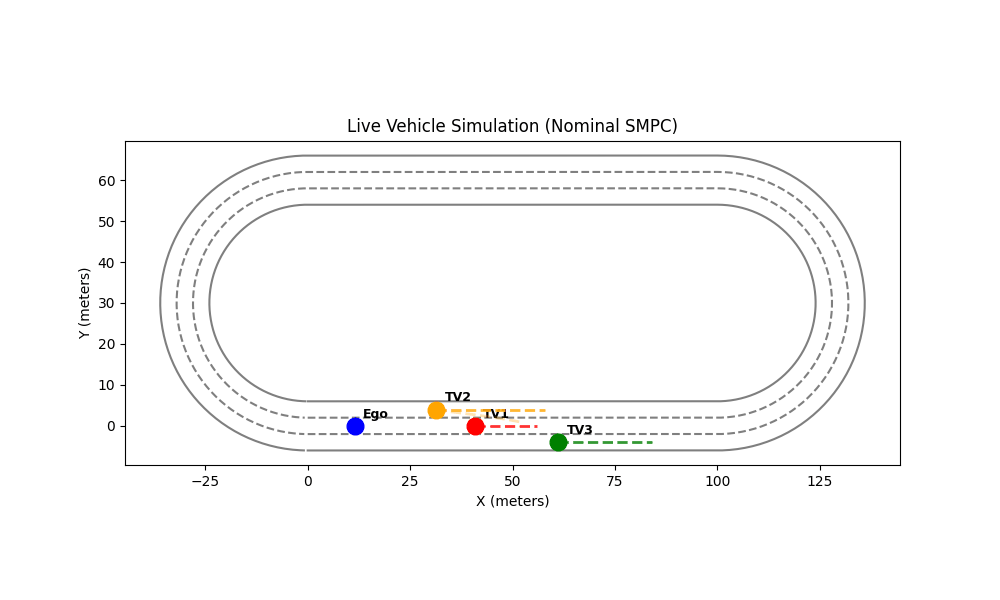
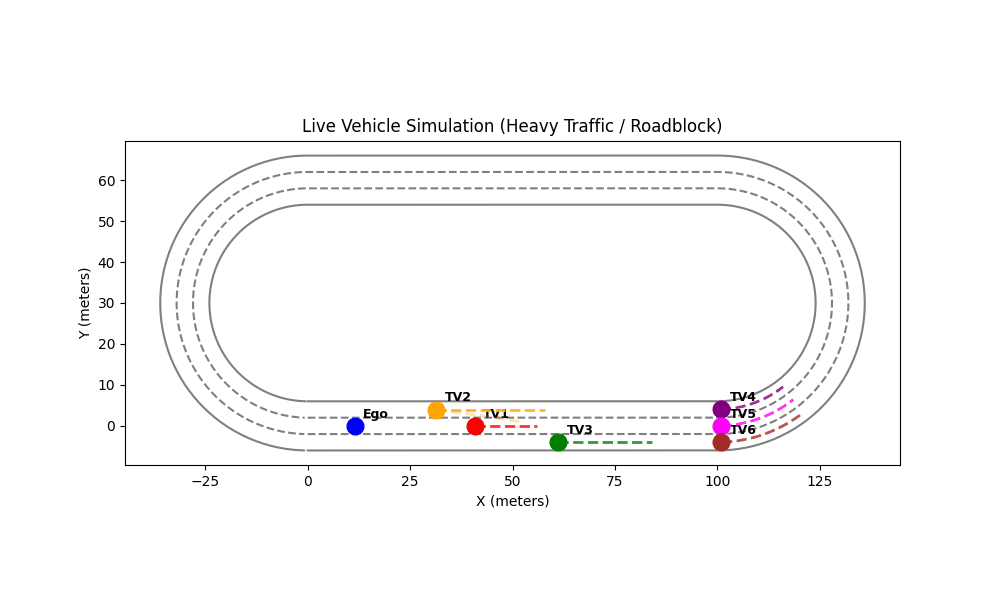
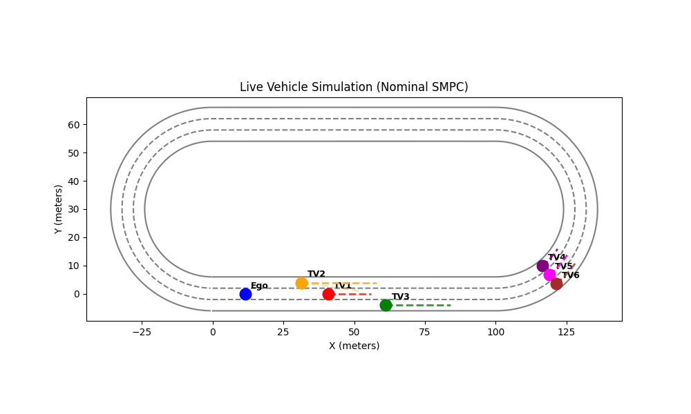

# Tree-Structured Stochastic MPC for Autonomous Lane Changing

A Python-based simulation of a **Tree-Structured Stochastic Model Predictive Controller (SMPC)** for autonomous highway driving. The ego vehicle navigates a closed oval track alongside multiple target vehicles with uncertain, multimodal behaviours modelled as Gaussian Mixture Models (GMMs).

Based on: *"Predictive Control for Autonomous Driving With Uncertain, Multimodal Predictions"* — Nair et al., IEEE Transactions on Control Systems Technology, Vol. 33(4), 2025.

---

## Demo

| Nominal Scenario | Heavy Traffic / Roadblock |
|:---:|:---:|
|  |  |

| Emergency Braking |
|:---:|
|  |

---

## Project Structure

```
final_lcs/
│
├── final_code/               ← Main simulation (Frenet frame, oval track)
│   ├── config.py             ← All tunable parameters (track, SMPC weights, limits)
│   ├── dynamics.py           ← FrenetVehicle class: kinematics + GMM predictions
│   ├── track.py              ← Frenet-to-Cartesian coordinate conversion
│   ├── smpc_controller.py    ← Tree-Structured SMPC solver (CVXPY + OSQP)
│   ├── main_sim.py           ← Nominal scenario: 3 target vehicles
│   ├── main_sim_2.py         ← Variant simulation
│   ├── main_sim_3.py         ← Variant simulation
│   └── main_sim_4.py         ← Heavy traffic / roadblock scenario with dashboard
│
├── paper_implementation/     ← Closer re-implementation of the full Nair et al. paper
│   ├── config.py             ← Straight highway config with collision ellipse params
│   ├── dynamics.py           ← Cartesian-frame vehicle dynamics
│   ├── env.py                ← Highway environment (state transitions, collision checks)
│   ├── advanced_smpc_controller.py  ← Full SMPC with policy trees & risk allocation
│   ├── run_advance_smpc.py   ← Entry point for the advanced simulation
│   ├── linearization.py      ← EV linearizer for LTV model
│   ├── batch_matrices.py     ← Computes lifted (batch) A, B matrices
│   ├── policy_tree.py        ← Parameterised policy tree variables
│   ├── reference.py          ← Reference trajectory generator
│   ├── mpc_controller.py     ← Simpler deterministic MPC baseline
│   ├── plot.py               ← Spatio-temporal trajectory visualiser
│   ├── smpc_controller.py    ← Basic SMPC controller
│   ├── run.py                ← Basic simulation runner
│   └── cartersian_coordinates/  ← Earlier Cartesian-frame prototype
│       ├── config.py
│       ├── dynamics.py
│       ├── env.py
│       ├── plot.py
│       └── run.py
│
└── results/                  ← Output GIFs and figures
    ├── result_1.gif
    ├── result_2.gif
    ├── result_3.gif
    ├── heavy_traffic.gif
    ├── break_forcing_1.gif
    ├── breaking_3.gif
    └── Figure_1.png
```

---

## How It Works

### Vehicle State (Frenet Frame)

Each vehicle is represented in the road-aligned Frenet frame:

```
state = [s, e_y, e_ψ, v]
```

- `s` — arc-length progress along the track centre-line
- `e_y` — lateral deviation from lane centre
- `e_ψ` — heading error relative to the lane tangent
- `v` — longitudinal speed

Control inputs are `[a, ψ̇]` (acceleration and yaw rate).

### The Track

A closed oval with two 100 m straights and two semicircular bends (radius = 30 m), giving a total length of ≈ 388.5 m. Three lanes are indexed by lateral offset: `e_y ∈ {−4, 0, +4}` m.

### Multimodal Predictions (GMM)

TV2 (the primary blocking vehicle) is given a **bimodal GMM**:

| Mode | Description | Weight |
|------|-------------|--------|
| 1 | Hold lane at constant speed | 0.60 |
| 2 | Brake and merge to centre lane | 0.40 |

All other target vehicles use single-mode constant-speed predictions.

### Tree-Structured SMPC

At every timestep, the controller builds a separate branch for each mode and solves a single joint Quadratic Programme (QP):

- **Branch variables** — separate state/control trajectories `{x_m, u_m}` per mode
- **Non-anticipativity constraint** — the first control action must be identical across all branches: `u_m[:,0] = u_1[:,0]` for all `m`
- **Reference shifting** — blocked lanes (occupied by TVs within 40 m) are excluded; the nearest free lane becomes the target
- **Emergency braking** — if all lanes are blocked, target velocity is set to 0

The QP is solved with **CVXPY + OSQP** and runs in ~5–10 ms per step.

### Paper Implementation

The `paper_implementation/` directory contains a fuller re-implementation of Nair et al. on a straight highway, adding:

- Parameterised **policy trees** with a configurable branch step
- **Risk allocation** variables (`ε_j`) with a total risk budget constraint: `p · ε ≤ 0.10`
- Dynamic safety buffers that shrink proportionally as more risk is allocated to a mode
- Minkowski-sum elliptical collision geometry

---

## Installation

```bash
pip install numpy matplotlib cvxpy osqp
```

Python 3.8+ is recommended.

---

## Running the Simulations

### Nominal Scenario (3 target vehicles, oval track)

```bash
cd final_code
python main_sim.py
# Output: nominal_smpc_simulation.gif
```

### Heavy Traffic / Roadblock Scenario (6 target vehicles + dashboard)

```bash
cd final_code
python main_sim_4.py
# Output: heavy_traffic_smpc.gif  +  heavy_traffic_dashboard.png
```

### Advanced Paper Implementation (straight highway, risk allocation)

```bash
cd paper_implementation
python run_advance_smpc.py
# Output: advanced_smpc_dashboard.png
```

### Cartesian Prototype (open-loop validation)

```bash
cd paper_implementation/cartersian_coordinates
python run.py
```

---

## Key Parameters (`final_code/config.py`)

| Parameter | Value | Description |
|-----------|-------|-------------|
| `DT` | 0.1 s | Simulation timestep |
| `N_HORIZON` | 20 | MPC prediction horizon (= 2 s look-ahead) |
| `V_REF` | 15.0 m/s | Target cruise speed |
| `LANE_WIDTH` | 4.0 m | Width of each lane |
| `Q_EY` | 50.0 | Lateral deviation penalty |
| `Q_EPSI` | 10.0 | Heading error penalty |
| `Q_V` | 20.0 | Speed tracking penalty |
| `R_YAW` | 100.0 | Steering smoothness penalty |
| `MAX_ACCEL` | 3.0 m/s² | Maximum throttle |
| `MIN_ACCEL` | −5.0 m/s² | Maximum braking |
| `MAX_YAW_RATE` | 0.5 rad/s | Maximum steering rate |

---

## Output Files

| File | Generated by | Description |
|------|-------------|-------------|
| `nominal_smpc_simulation.gif` | `main_sim.py` | Animated oval track, nominal scenario |
| `heavy_traffic_smpc.gif` | `main_sim_4.py` | Animated oval track, roadblock scenario |
| `heavy_traffic_dashboard.png` | `main_sim_4.py` | 6-panel performance metrics plot |
| `advanced_smpc_dashboard.png` | `run_advance_smpc.py` | Paper implementation metrics |

---

## References

> S. H. Nair, H. Lee, E. Joa, Y. Wang, H. E. Tseng, and F. Borrelli, "Predictive Control for Autonomous Driving With Uncertain, Multimodal Predictions," *IEEE Transactions on Control Systems Technology*, vol. 33, no. 4, pp. 1178–1192, 2025.
